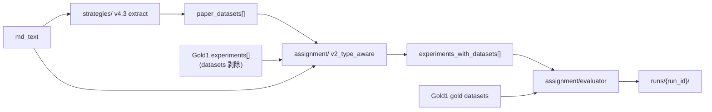

# Datasets 字段提取实验

## 目标

从论文 Markdown 中提取结构化 `datasets` 字段，并按需 **分配到各 experiment**。

## 两阶段流水线（extract → assign）



- **`strategies/`**：`(md_text, paper_id) → paper_datasets[]`，paper 级提取（**默认 v4.3**；v4.5/v4.6 opt-in，见 [`strategies/v4_5_report.md`](strategies/v4_5_report.md)、[`strategies/v4_6_report.md`](strategies/v4_6_report.md)）
- **`assignment/`**：`(paper_datasets, experiments[], md_text) → experiments_with_datasets[]`，
  per-experiment 后分配（**当前最优：`v2_type_aware`**）。详见 [`assignment/README.md`](assignment/README.md) +
  [`assignment/v2_report.md`](assignment/v2_report.md)
- **评估**：paper 级用 `shared/dataset_evaluator.py` + Gold2；
  per-experiment 用 `assignment/evaluator.py` + Gold1

## Gold 标准（子项目内）

| 集合 | 路径 | 说明 |
|------|------|------|
| Gold1 | `data/gold/dev_10/per_experiment/` | 保留 LLM experiment 数组 |
| Gold2 | `data/gold/dev_10/paper_union/` | **默认评估**：按 paper_id 合并去重 |

构建 Gold：

```bash
python experiments/rule_extraction/datasets/scripts/build_gold_sets.py --batch dev_10
```

详见 [`data/gold/README.md`](data/gold/README.md)。

## 策略

| 策略 | 描述 | 状态 |
|------|------|------|
| v1 | Section+Table 提取 | 基线 |
| v2 | 关键词全文匹配（高召回） | 基线 |
| v3 | Gazetteer 硬过滤 + 强语境 | 基线 |
| v4 | Layer A/B 分层 + Gazetteer 软 confidence + scoped 表格 | 基线 |
| v4_3 | Union（v4.1 + Branch B 语境过滤 + manual gazetteer 扩充） | **默认 extract** |
| v4_5 | Union（Branch B tight match + hybrid gazetteer） | opt-in 实验 |
| v4_6 | Union（Branch B tiered match + hybrid gazetteer） | opt-in 实验 |

设计说明：[`strategies/v4_report.md`](strategies/v4_report.md)、[`strategies/v4_3_report.md`](strategies/v4_3_report.md)、[`strategies/v4_5_report.md`](strategies/v4_5_report.md)、[`strategies/v4_6_report.md`](strategies/v4_6_report.md)

```bash
# 默认仍为 v4_3；显式启用 v4.5 / v4_6
python -m experiments.rule_extraction.datasets.test_runner --strategy v4_6 --batch dev_10
```

## 运行评估

```bash
# paper 级（默认 Gold2 + strict/fuzzy/semantic）
python -m experiments.rule_extraction.datasets.test_runner --compare-all

# 指定 run id 与 gold 集合
python -m experiments.rule_extraction.datasets.test_runner \
  --compare-all \
  --gold-set paper_union \
  --run-id my_run \
  --semantic-type jaccard

# 单策略
python -m experiments.rule_extraction.datasets.test_runner --strategy v4

# per-experiment assignment 评估（v4.3 extract → v2_type_aware assign → Gold1 对比）
python -m experiments.rule_extraction.datasets.test_runner \
  --strategy v4_3 --assign-strategy v2_type_aware --stage both \
  --batch dev_20 --gold-set per_experiment \
  --run-id 20260706_assign_v2_dev20 --eval-modes strict,fuzzy

# v1 对照仍可用：--assign-strategy v1_cooccurrence
```

## Run 目录（可复盘）

每次运行写入 `runs/{run_id}/`：

```
runs/{run_id}/
├── run_manifest.json       # 配置、步骤时间线、汇总指标
├── steps/                  # 每步 JSON 记录
├── results/                # v1-v4 完整结果
├── traces/v3|v4/           # 逐篇 trace
└── analysis/               # comparison.md, per_paper_breakdown.md
```

最新 baseline：`runs/20260703_v4_baseline/`（Gold2, dev_10）

### 20260703_v4_baseline 摘要（fuzzy）

| 策略 | Recall | Precision | F1 |
|------|--------|-----------|-----|
| v1 | 9.76% | 66.67% | 17.02% |
| v2 | 35.37% | 9.18% | 14.57% |
| v3 | 15.85% | 59.09% | 25.00% |
| **v4** | **67.07%** | **22.18%** | **33.33%** |

## 评估指标

- **strict**：归一化字符串精确匹配
- **fuzzy**：去后缀 + 子串 + Gazetteer alias 等价（规则探索主指标）
- **semantic**：`SemanticScorer`（默认 jaccard；可选 embedding）

## 其他产物

- `data/gazetteer.json` — Gazetteer 白名单（v4.3 Branch A/B 默认）
- `data/gazetteer_hybrid.json` — manual ∪ 20K（`paper_count≥10`），v4.5 Branch B 用
- `scripts/build_gazetteer.py` — 重建 Gazetteer
- `scripts/build_gazetteer_hybrid.py` — 构建 hybrid gazetteer
- `analysis/generate_comparison.py` — 从 run 目录生成报告
