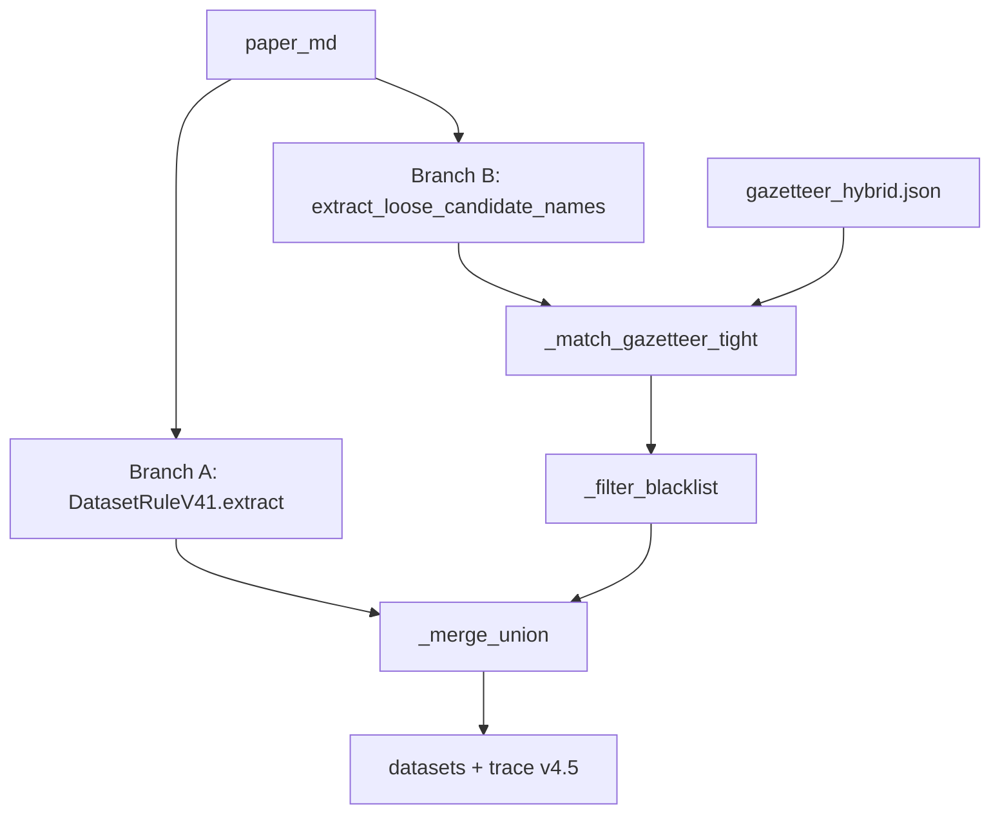

# v4.5 — Union (Branch B tight + Hybrid gazetteer)

> **实验分支（opt-in）**：默认 extract 仍为 **v4.3**（dev_10 fuzzy F1=56.14%）。
> v4.5 未超越 v4.3，详见下文评估结论。

## 定义

**v4.5 = v4.3 Union 架构 + Branch B 两处改动**

| 组件 | v4.3 | v4.5 |
|------|------|------|
| Branch A | `DatasetRuleV41.extract()` + 默认 `gazetteer.json` soft match | **相同** |
| Branch B match | `DatasetRuleV3._match_gazetteer`（双向子串） | **`_match_gazetteer_tight`**（v4.3.1） |
| Branch B gazetteer | `gazetteer.json`（1,277 条 manual） | **`gazetteer_hybrid.json`**（manual ∪ 20K `paper_count≥10`） |
| Merge | `_merge_union` 全量输出 | **相同**（无 confidence 后过滤） |



**实现约束**：Branch A 必须先于 gazetteer 切换执行。v4.5 不得在 `extract()` 开头设置 `RULE_GAZETTEER_PATH`，否则 v41 soft match 会误用 hybrid。

## 与 v4.3 / v4.3.1 / v4.4 对比

| 版本 | Branch B match | Gazetteer | 定位 |
|------|----------------|-----------|------|
| v4.3 | 双向子串 | manual 1,277 | **当前最优 extract** |
| v4.3.1 | tight（单向子串 + 长度/黑名单） | manual 1,253（不扩充） | 收紧实验，未替换 v4.3 |
| v4.4 | 双向子串 | 全量 20K（7,442 条） | precision 崩塌，F1 退步 |
| **v4.5** | **tight** | **hybrid 1,818**（manual + 高频 20K） | tight + 适度自动扩充 |

v4.5 动机：在 v4.4 教训（全量 20K + 双向子串 → precision 崩塌）基础上，用 **tight match** 抑制噪声，同时用 **hybrid**（仅 `paper_count≥10` 的 542 条新条目）补充 manual 未覆盖的高频数据集名。

## Hybrid gazetteer 构建

```bash
python experiments/rule_extraction/datasets/scripts/build_gazetteer_hybrid.py \
  --manual data/gazetteer.json \
  --auto data/gazetteer_20k.json \
  --min-paper-count 10 \
  --output data/gazetteer_hybrid.json
```

统计（`data/gazetteer_hybrid_stats.json`）：

| 指标 | 值 |
|------|-----|
| manual_count | 1,277 |
| auto_eligible (≥10) | 1,101 |
| merged_total | **1,818** |
| only_manual | 719 |
| only_20k | 542 |
| overlap | 558 |

manual 冲突时保留 manual 的 `canonical_name` / `aliases`。

## 为何不做 Union 后 confidence filter

1. v4.3 当前最优已依赖 Branch A（v4.1 soft confidence）+ Branch B（gazetteer 硬过滤）的 **并集**；Union 后再滤会误删 Branch A 独有真阳性。
2. 本实验目标是隔离 **tight match + hybrid** 的边际效应，而非引入第三层启发式。
3. v4.3.1 已证明仅靠 tight 而不扩充 gazetteer 会损 recall；v4.5 用 hybrid 补偿 recall，若再加 filter 难以归因。

## 运行

```bash
# v4.5 dev_10
python -m experiments.rule_extraction.datasets.test_runner \
  --strategy v4_5 --batch dev_10 --gold-set paper_union \
  --run-id 20260706_v4_5_dev10 --eval-modes strict,fuzzy

# v4.3 对照（默认 extract）
python -m experiments.rule_extraction.datasets.test_runner \
  --strategy v4_3 --batch dev_10 --gold-set paper_union \
  --run-id 20260706_v4_5_baseline_dev10 --eval-modes strict,fuzzy

# v4.5 dev_20 泛化
python -m experiments.rule_extraction.datasets.test_runner \
  --strategy v4_5 --batch dev_20 --gold-set paper_union \
  --run-id 20260706_v4_5_dev20 --eval-modes strict,fuzzy
```

`--extract-strategy` 默认值仍为 `v4_3`；显式指定 `--strategy v4_5` 才启用本版。

## 评估结果（Gold2 / paper_union）

run_id: `20260706_v4_5_*`

### dev_10（10 papers, 82 gold datasets）

| 策略 | fuzzy R | fuzzy P | fuzzy F1 | strict F1 | rule 总数 |
|------|---------|---------|----------|-----------|-----------|
| **v4.3** | **58.54%** | 53.93% | **56.14%** | 49.12% | 89 |
| v4.5 | 50.00% | **56.16%** | 52.90% | 49.03% | 73 |

Δ fuzzy F1: **−3.24pp**（recall −8.54pp，precision +2.23pp）

### dev_20（20 papers, 78 gold datasets）

| 策略 | fuzzy R | fuzzy P | fuzzy F1 | strict F1 | rule 总数 |
|------|---------|---------|----------|-----------|-----------|
| v4.3 | **61.54%** | 27.43% | 37.94% | 32.41% | 175 |
| v4.5 | 58.97% | **30.87%** | 40.53% | 36.12% | 149 |

Δ fuzzy F1: **+2.59pp**（precision +3.44pp，recall −2.57pp）；dev_20 上 v4.5 略优于 v4.3，但两者 precision 均偏低。

### Merge 分支贡献（trace `extraction` 汇总）

| batch | 策略 | gazetteer_only | v4_1_only | both |
|-------|------|----------------|-----------|------|
| dev_10 | v4.3 | 32 | 32 | 27 |
| dev_10 | v4.5 | **17** | 44 | 15 |
| dev_20 | v4.3 | 57 | 72 | 52 |
| dev_20 | v4.5 | **32** | 91 | 33 |

tight match 显著减少 `gazetteer_only`（dev_10: 32→17，dev_20: 57→32），符合设计预期；但 `both` 也下降，说明 Branch B 对已与 Branch A 重叠的真名匹配变少，是 dev_10 recall 下降主因之一。

### v4.3 回归 smoke

`20260706_v4_5_smoke_v43`（dev_10 extract-only）：fuzzy F1=**56.14%**，与 baseline 一致，v4.3 行为未被 v4.5 代码污染。

## Case study

### `5b1643ba`（face survey, dev_10 gold=43）

| 策略 | fuzzy R | fuzzy P | rule_count |
|------|---------|---------|------------|
| v4.3 | 55.81% | 70.59% | 34 |
| v4.5 | 44.19% | **73.08%** | 26 |

v4.5 precision 略升但 recall 明显降：tight match 拒绝了一些 v4.3 能通过双向子串命中的 face 别名（如 `RFW`、`Replay-Attack`、`CASIA-FASD` 在 strict 下 v4.5 未匹配）。Branch A 仍用 manual gazetteer，hybrid 对 Branch B 的额外条目未能弥补 tight 损失的 recall。

### `6632f3d`（JAAD / HighD / PSI, dev_10 gold=3）

两版 fuzzy F1 均为 **66.67%**（匹配 HighD、PSI，漏 JAAD；extra `kgefromthehighd`）。tight+hybrid 对此篇无显著差异。

### `66bac1ca`（Flickr30K / CC152K / MS-COCO, dev_20 gold=3）

| 策略 | fuzzy R | fuzzy P | extras 含 sgraf/following |
|------|---------|---------|---------------------------|
| v4.3 | 33.33% | 11.11% | 是 |
| v4.5 | 33.33% | **14.29%** | 是（少 2 条：circle、cococaptions） |

两版均未召回 Flickr30K / CC152K；`following`、`sgraf` 等噪声在 v4.5 略减（7→5 条预测）但未消除。

## 结论

1. **v4.3 + manual gazetteer 仍为 extract 当前最优**（dev_10 F1=56.14%）。
2. v4.5 在 dev_10 **未达成功标准**（F1 低于 v4.3）；dev_20 有小幅 F1 提升但绝对值仍低。
3. tight match 有效降低 `gazetteer_only` 噪声，但 **recall 代价在 dev_10 上不可接受**；hybrid 542 条新条目未能抵消 tight 的漏召。
4. v4.5 作为 **opt-in 实验分支** 保留，供后续 gazetteer / match 策略对照；**不修改** v4.3 默认与 `v4_3_report.md`「当前最优」标注。

## 附录：后续扫参方向（不改默认）

| 实验 | 假设 | 命令要点 |
|------|------|----------|
| `min_paper_count=5` | 更多 20K 条目补 recall | `build_gazetteer_hybrid.py --min-paper-count 5` + `--gazetteer-path` |
| `min_paper_count=20` | 更高 precision | 同上 `--min-paper-count 20` |
| Branch B 仅 manual | 隔离 hybrid 效应 | `RULE_GAZETTEER_PATH=data/gazetteer.json` + v4.5 代码 |

以上扫参仅建议在 report/run 中记录，**不纳入本版默认**。

## trace 字段

- `version`: `"v4.5"`
- `branch_b.after_gazetteer_tight`: tight match 后候选（对齐 v4.3.1）
- `tightening.branch_b_tight_match`: `true`
- `tightening.gazetteer_source`: `"hybrid"`
- `tightening.min_paper_count`: `10`
- `extraction_source`（Branch B）: `v4_loose_gazetteer_tight`
