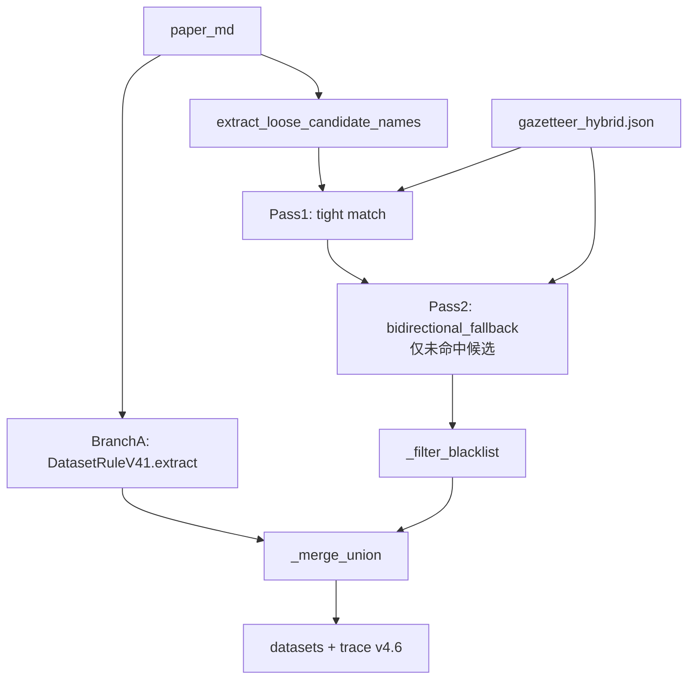

# v4.6 — Union (Branch B tiered match + Hybrid gazetteer)

> **实验分支（opt-in）**：默认 extract 仍为 **v4.3**（dev_10 fuzzy F1=56.14%）。
> v4.6 未达成主 KPI，详见成功标准判定。

## 定义

**v4.6 = v4.5 架构 + Branch B 分级匹配 `_match_gazetteer_tiered`**



| 组件 | v4.5 | v4.6 |
|------|------|------|
| Branch A | `DatasetRuleV41` + 默认 `gazetteer.json` | **相同** |
| Branch B gazetteer | `gazetteer_hybrid.json` | **相同** |
| Branch B match | 仅 tight | **tight → 受控双向 fallback** |
| Merge | `_merge_union` 全量 | **相同**（无 confidence 后过滤） |

### Pass 1 — tight（同 v4.3.1 / v4.5）

- `candidate_norm ⊂ canonical_norm/alias_norm`
- overlap ≥ 0.7，key 长度 ≥ 4，`WEAK_SEMANTIC_BLACKLIST`

### Pass 2 — bidirectional_fallback（仅 Pass 1 未命中）

- 双向子串（同 v4.3 方向），但收紧：
  - min key 长度 **4**（v4.3 为 3）
  - overlap ≥ **0.6**（v4.3 为 0.5）
  - candidate + canonical/alias 均检查黑名单
  - canonical_norm 长度 < 4 的条目跳过

## 动机（相对 v4.5）

v4.5 tight 降低了 `gazetteer_only` 噪声，但 dev_10 `both` 从 27 降至 15，recall 损失 8.54pp。v4.6 用 Pass 2 尝试在保持低噪声的同时找回 B 路真阳性。

## 运行

```bash
python -m experiments.rule_extraction.datasets.test_runner \
  --strategy v4_6 --batch dev_10 --gold-set paper_union \
  --run-id 20260706_v4_6_dev10 --eval-modes strict,fuzzy
```

`--extract-strategy` 默认仍为 `v4_3`。

## 评估结果（Gold2 / paper_union）

run_id: `20260706_v4_6_*`

### dev_10（10 papers, 82 gold datasets）

| 策略 | fuzzy R | fuzzy P | fuzzy F1 | strict F1 | rule 总数 |
|------|---------|---------|----------|-----------|-----------|
| **v4.3** | **58.54%** | 53.93% | **56.14%** | 49.12% | 89 |
| v4.5 | 50.00% | **56.16%** | 52.90% | 49.03% | 73 |
| v4.6 | 51.22% | 53.85% | 52.50% | 48.75% | 78 |

Δ vs v4.3：F1 **−3.64pp**；Δ vs v4.5：R **+1.22pp**，F1 **−0.40pp**

### dev_20（20 papers, 78 gold datasets）

| 策略 | fuzzy R | fuzzy P | fuzzy F1 | strict F1 |
|------|---------|---------|----------|-----------|
| v4.3 | 61.54% | 27.43% | 37.94% | 32.41% |
| v4.5 | 58.97% | 30.87% | 40.53% | 36.12% |
| v4.6 | 58.97% | 29.11% | 38.98% | 34.75% |

v4.6 dev_20 recall 与 v4.5 持平，但 precision 低于 v4.5，F1 介于 v4.3 与 v4.5 之间。

### Merge / Pass 统计（trace 汇总）

| batch | 策略 | gazetteer_only | both | v4_1_only | Pass tight | Pass fallback | go_tight | go_fallback |
|-------|------|----------------|------|-----------|------------|---------------|----------|-------------|
| dev_10 | v4.3 | 32 | **27** | 32 | — | — | — | — |
| dev_10 | v4.5 | **17** | 15 | 44 | — | — | — | — |
| dev_10 | v4_6 | 22 | 16 | 43 | 34 | 8 | 17 | 5 |
| dev_20 | v4.6 | 41 | 34 | 90 | 69 | 13 | 32 | 9 |

相对 v4.5：v4.6 的 `both` 略升（15→16），`gazetteer_only` 略增（17→22），说明 fallback 部分找回了 B 路与 A 路重叠项，但仍远低于 v4.3 的 `both=27`。

### v4.3 回归 smoke

`20260706_v4_6_smoke_v43`：fuzzy F1=**56.14%**，与基线一致。

## Case study

### `5b1643ba`（face survey, dev_10 gold=43）

| 策略 | fuzzy R | fuzzy P | F1 | rule_count |
|------|---------|---------|-----|------------|
| v4.3 | **55.81%** | 70.59% | **62.34%** | 34 |
| v4.5 | 44.19% | 73.08% | 55.07% | 26 |
| v4.6 | 46.51% | 71.43% | 56.34% | 28 |

v4.6 相对 v4.5 recall 回升 2.32pp，但仍低于 v4.3。Pass 2 fallback 示例（trace `match_details`）：

- `ARTS ON MSCELEB -1M` → `MS-Celeb-1M`（fallback，有益）
- `CASIA` → `CASIA-HFB`（fallback，可能误匹配）
- `PaSC` → `Pascal dataset`（fallback，**明显误匹配**）

fallback 在 face 领域引入了子串误命中，部分抵消 recall 收益。

### `6632f3d`（JAAD / HighD / PSI）

三版 fuzzy F1 均为 **66.67%**，分级 match 无差异。

### `66bac1ca`（Flickr30K / CC152K / MS-COCO, dev_20）

v4.6：fuzzy R=33.33%，P=14.29%；extras 仍含 `following`、`sgraf` 等。Branch A 漏抽问题未解决。

## 成功标准判定

| 条件 | 阈值 | v4.6 结果 | 达成 |
|------|------|-----------|------|
| 主 KPI | dev_10 fuzzy F1 ≥ 56.14% | **52.50%** | **否** |
| 次要 | dev_10 fuzzy P ≥ 53.93% | 53.85% | 是（边际） |
| 噪声 | dev_10 gazetteer_only ≤ 32 | **22** | **是** |
| case | `5b1643ba` fuzzy R ≥ 50% | **46.51%** | **否** |
| 回归 | v4.3 smoke F1 = 56.14% | 56.14% | **是** |

**结论**：v4.6 **未达成主 KPI**，**不建议**替换 v4.3 默认 extract。保留为 opt-in 实验分支。

相对 v4.5 的改进有限（dev_10 R +1.22pp，F1 仍低于 v4.5），Pass 2 双向兜底在 hybrid gazetteer 上仍会产生子串误匹配（如 PaSC→Pascal dataset）。

## 下一步（附录，不改默认）

1. **Pass 2 overlap 0.55 扫参**：略放宽可能多救 face 别名，但可能增加 dev_20 噪声。
2. **Pass 2 限制来源**：仅对 `abbrev_ref` / table 来源候选开放 fallback（需从 `loose_trace` 构建 candidate→source 映射）。
3. **Branch A recall**（JAAD / Flickr30K / CC152K）：留 v4.7+，本任务 OUT OF SCOPE。

## trace 字段

- `version`: `"v4.6"`
- `branch_b.after_tight` / `after_tiered` / `match_details` / `pass_counts`
- `tightening.branch_b_tiered_match`: `true`
- `extraction.branch_b_tight_count` / `branch_b_fallback_count`
- `extraction.gazetteer_only_tight` / `gazetteer_only_fallback`
